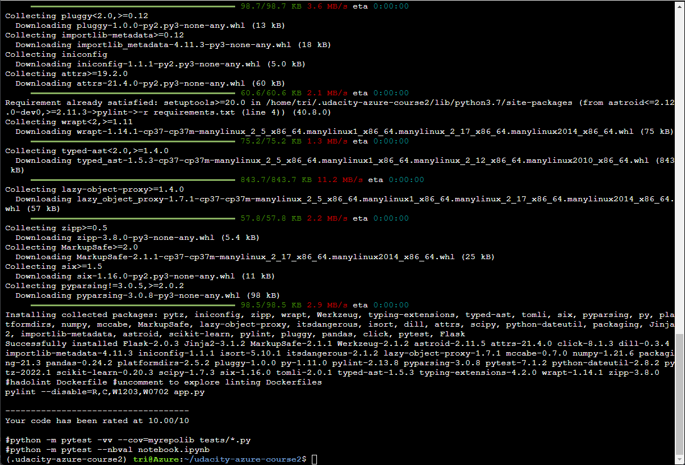
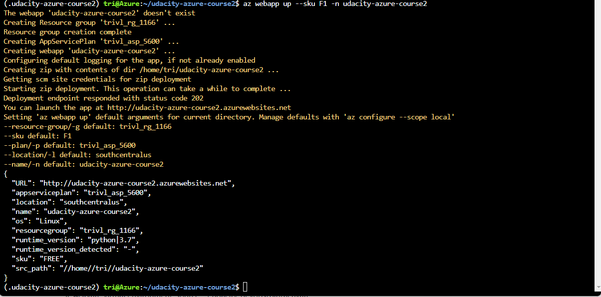
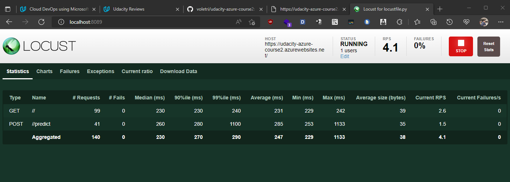

# Overview

This is the second project of Udacity Cloud DevOps Engineer using Azure Nanodegree.

# Project Plan
<TODO: Project Plan

* A link to a Trello board for the project:

https://trello.com/b/mkRe5Rne/udacity-azure-course2
* A link to a spreadsheet that includes the original and final project plan:

https://docs.google.com/spreadsheets/d/1Q3iyPWt2bHowQ76-PuupFn5tF3dBx7mrWktgoqO_E2I/edit?usp=sharing

# Instructions


## Architectural Diagram


## Project cloned into Azure Cloud Shell
* Go to https://portal.azure.com/#cloudshell/ and run command:
```
ssh-keygen -t rsa
cat ~/.ssh/id_rsa.pub
```
* Add public key to GitHub. (GitHub > Settings > SSH and GPG keys > Paste > Add the key)
* Clone the repository
```
git clone git@github.com:voletri/udacity-azure-course2.git
```


## Passing tests that are displayed after running the `make all` command from the `Makefile`
* Create a virtual environment
```
python3 -m venv ~/.udacity-azure-course2
source ~/.udacity-azure-course2/bin/activate
```
* Run: make all
```
cd udacity-azure-course2
make all
```

* The following commands can be run in order to then test and start the application:
```
export FLASK_APP=app.py
flask run
```

## Project running on Azure App Service
* Go to https://portal.azure.com/#cloudshell/
* Run command to create webapp:
```
az webapp up --sku F1 -n udacity-azure-course2
```
* Confirm webapp is created successfully


    Confirm app is up and running
    ```
    https://udacity-azure-course2.azurewebsites.net
    ```

## Configure GitHub Actions
* GitHub > Actions > set up a workflow yourself
```
name: Python application test with Github Actions

on: [push]

jobs:
  build:

    runs-on: ubuntu-latest

    steps:
    - uses: actions/checkout@v3
    - name: Set up Python 3.7
      uses: actions/setup-python@v1
      with:
        python-version: 3.7
    - name: Install dependencies
      run: |
        make install
    - name: Lint with pylint
      run: |
        make lint
    - name: Test with pytest
      run: |
        make test
```

## Configure Azure Pipeline
[Note the official documentation should be referred to and double checked asyou setup CI/CD](https://docs.microsoft.com/en-us/azure/devops/pipelinesecosystems/python-webapp?view=azure-devops).
Successful deploy of the project in Azure Pipelines.


* Logs from your running application here:
```
https://udacity-azure-course2.scm.azurewebsites.net/api/logs/docker
```
* Running Azure App Service from Azure Pipelines automatic deployment

* Successful prediction from deployed flask app in Azure Cloud Shell.  [Use this file as a template for the deployed prediction](https://github.com/udacity/nd082-Azure-Cloud-DevOps-Starter-Code/blob/master/C2-AgileDevelopmentwithAzure/project/starter_files/flask-sklearn/make_predict_azure_app.sh).
The output should look similar to this:

```bash
(.udacity-azure-course2) tri@Azure:~/udacity-azure-course2$ sh make_predict_azure_app.sh
Port: 443
{"prediction":[20.35373177134412]
```

* Output of streamed log files from deployed application

Go to https://portal.azure.com/ -> App Service -> Select app -> In tab Monitoring -> Log stream


Or using command to display the logs of the server:
```
az webapp log tail -g trivl_rg_1166 -n udacity-azure-course2
```

## Enhancements

Improve error handling and tesing, i will implement [Locust](https://locust.io/)

* Output of locust

Create file `locustfile.py`

Using command start a local service in your environment, default port is 8089
```
locust -f locustfile.py
```

## Demo 


